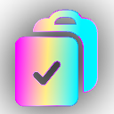

# Copy with URL Chrome Extension

<p>This is a straightforward chrome extension that automatically includes the URL of a page when you copy text to the clipboard.

## Installation

This is my first chrome extension, and I am still looking into putting it on the Chrome Web Store. If you would like to use this extension in the meantime, you can install it by following these steps:

1. ```
   git clone https://github.com/kielmarj/copy-with-url-chrome-extension
   ```
2. Open your browser and go to `chrome://extensions/`
3. Enable Developer mode
4. Click `load unpacked` and select the copy-with-url-chrome-extension folder

## Usage

Use Alt+C or Right-click > 'Copy with URL' to copy selected text. The URL will be preprended to your copied text.

### Customization

Visit the 'Options' page for the extension to specify your preferred format. Choose from:
  - Markdown. Pasted texted example:
    ```markdown
    [Page title](https://www.example.com)

    Copied text here ...
    ```
  - HTML. Pasted text example:
    ```html
    <a href="https://www.example.com">Page title</a><br>
	
	Copied text here ...
    ```
  - Plain text. Pasted text example:
    ```txt
    Page title - https://www.example.com

    Copied text here ...
    ```
If not configured, the default format is plain text.

Optionally, you can prefix the URL with text of your choice, such as "Source:". This can be configured on the 'Options' page as well.

## Contributing

You are invited to reach out or contribute if you experience any issues or have any suggestions for ipmrovements. I'd love to hear from you!

## License

This extension is licensed under the MIT License. Feel free to copy, modify, redistribute, etc, as long as you include the original copyright notice and the information included in the LICENSE file.

<div align="center">
  <sub><i>© 2024 <a href="https://github.com/kielmarj">kielmarj</a>, MIT License</i></sub><br>
  <a href="https://www.buymeacoffee.com/kielmarj" target="_blank"></a>
</div>
